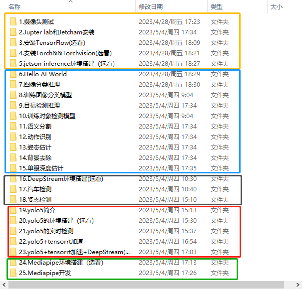

# 1.1 学习路线

1. 本产品提供出厂镜像，可使用套餐自带的**固态硬盘**插入主板开机，不需要按照本教程重复烧录镜像。详细的镜像环境可以参考附录镜像里面的文档。如果烧录的是 Jetson Orin NX 官方镜像，则需要自己搭建相关的 AI 环境。因软件版本差异可能会出现报错，需自行想办法解决。
   
   烧录镜像的方法请看 👉 **第 2 章 基础教程**。

2. 烧录其他第三方镜像，并顺利开机后，想要对 Jetson Orin NX 进行一些简单的配置 👉 **第 3 章 系统设置**。
    - SD 卡扩容
    - SSH / VNC 登录
    - Windows 和 Jetson Orin NX 相互传输文件
    - 增大 Jetson Orin NX 的空间
    - 系统备份

3. 想要了解 Jetson Orin NX 的 GPIO 口的用法，并具有一定的 Python 基础 👉 **第 4 章 GPIO 硬件控制**。
4. 想要学习人工智能视觉 👉 **第 5 章 AI 视觉进阶教程**

每一种颜色的框为一个部分，每一个部分都依赖上一个部分，很少可以独立工作。如果前一部分的环境没有搭建，后一部分在运行时就会报错。

使用亚博搭建好的镜像可以直接运行里面的 AI 案例。

5. 想要学习 ROS 的系统课程，可以观看 👉 **第 6 章 ROS 进阶教程**。掌握了 ROS 的知识后，可以购买我们的 ROS 配件进行进阶学习。我们搭建好的镜像也有对应 ROS 配件的源码。