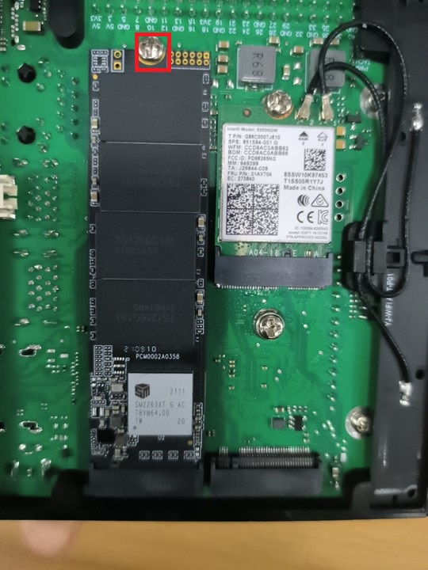
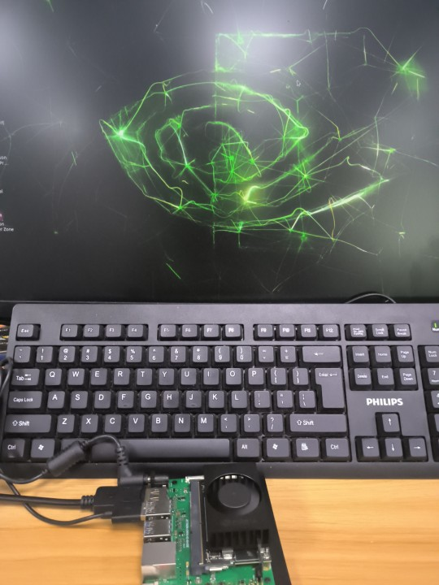
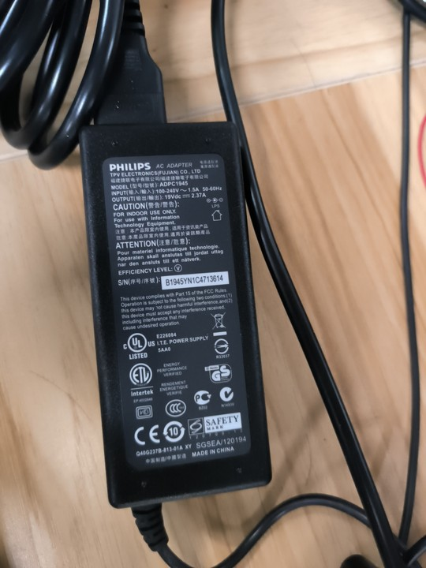
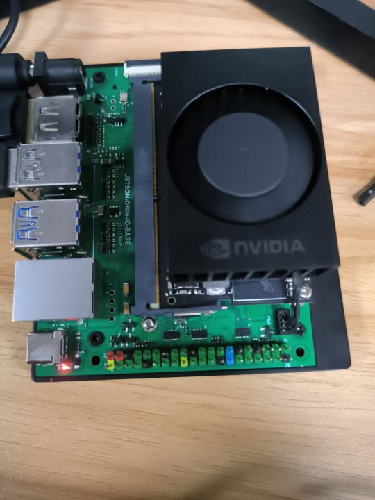

# 3.1 Jetson Orin NX 启动

1. 将烧录好镜像的固态硬盘插进主板的固态硬盘的卡槽中，并将卡槽的螺丝拧紧

2. 接入电源，用 DP 线连接显示器

3. 用官方配套的 **19V 2.37A** 圆头 DC 接口电源给 Orin NX 板子供电。

1. 开发板只要接通电源就会启动，不需要按下 PWR 按钮。启动时可以看到 DS1 指示灯亮起，等待系统进入到桌面。

