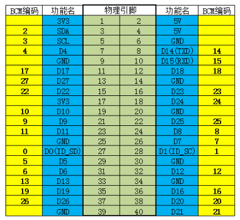

# 4.2 硬件库配置

## 1. 介绍

原文：[Jetson.GPIO - Linux for Tegra](https://github.com/NVIDIA/jetson-gpio/blob/master/README.md)

Jetson TX1，TX2, AGX Xavier, Nano 和 Orin 系列的开发板都含有一个
40 pin 的 GPIO 连接器，和树莓派的 40 pin 连接器类似。

你可以使用 Jetson GPIO Library package
提供的 Python 库来控制这些 GPIO 的输入和输出。
这个库带有的 API 和 树莓派的 RPi.GPIO 库是一样的，
所以你可以很方便地将树莓派上的代码移植到 Jetson 开发板上。

PyPI 链接：[Jetson.GPIO - PyPI](https://pypi.org/project/Jetson.GPIO/)

## 2. 引脚定义



## 3. 环境配置

以下是手动安装 jetson-gpio Python 库的步骤。

### 3.1. 下载 jetson-gpio

```bash
git clone https://github.com/NVIDIA/jetson-gpio.git
```

或者从源码网址下载 zip 文件并解压。

### 3.2. 移动到 `/opt/nvidia` 目录

如果 `/opt/nvidia` 目录下已经有 jetson-gpio 库了，我们需要将原有的库备份

```bash
sudo mv jetson-gpio jetson-gpio_bak
```

再将克隆 / 下载解压的文件夹移动到 `/opt/nvidia` 目录下。

### 3.3. 安装 pip3 工具

```bash
sudo apt-get install python3-pip
```

### 3.4. 安装 jetson-gpio 库

```bash
cd /opt/nvidia/jetson-gpio
sudo python3 setup.py install
```

### 3.5. 创建一个 GPIO 用户组

在开始使用 GPIO 库之前，你需要创建一个 GPIO 用户组，
并将你当前的用户添加到这个用户组中，并授予访问权限。

```bash
sudo groupadd -f -r gpio
sudo usermod -a -G gpio $USER

sudo cp /opt/nvidia/jetson-gpio/lib/python/Jetson/GPIO/99-gpio.rules /etc/udev/rules.d/
```

要使新的规则生效，你需要重启或者重新加载 udev 规则。
重新加载 udev 规则的命令如下：

```bash
sudo udevadm control --reload-rules && sudo udevadm trigger
```
