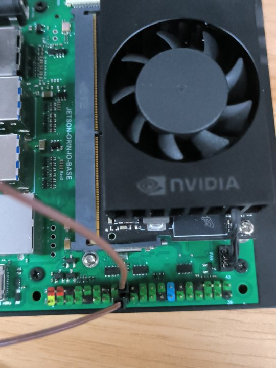

# 4.3 引脚读取功能

配置好环境后，你就可以测试例程了。

[jetson-gpio](https://github.com/NVIDIA/jetson-gpio)
提供了若干示例程序，我们可以进入库目录进行简单的测试：

```bash
cd /opt/nvidia/jetson-gpio/samples
```

## 接线图



## `simple_input.py`

这是一个使用 BCM 编号的简单输入程序。
它会读取物理编号为 PIN12 引脚的电平状态，并输出到终端。

运行程序：
    
```bash
sudo python3 simple_input.py
```

## 预期结果

程序开始运行后，你就可以在终端看到输出了。
默认情况下，PIN18 的状态是低电平。

取一根杜邦线，将它的两端分别插入 PIN12 和 3.3V 引脚，然后你就可以观察到读取值变成了 HIGH。
把杜邦线插到 GND 引脚，读取值就会变成 LOW。

```
nano@nano-desktop:/opt/nvidia/jetson-gpio/samples$ sudo python3 simple_input.py
[sudo] password for nano:
Starting demo now! Press CTRL+C to exit
Value read from pin 18: LOW
Value read from pin 18: HIGH
Value read from pin 18: LOW
```

> [!NOTE]
> - 终端输出的 "18" 指的是 BCM 编号，而前文提到的 "PIN12" 指的是物理编号，即开发板丝印上的编号。
> - Jetson Orin NX 引脚的工作电平是 3.3V，所以不要接到 5V 或者其他电压上。
