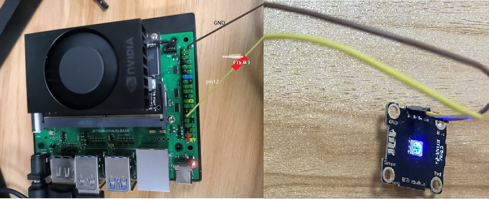

# 4.5 控制 LED

本文演示使用 Jetson Orin NX 的 GPIO 控制 LED 灯。
程序来自出厂自带的 GPIO_test/led.py。

## 硬件连接

演示使用了亚博提供的 [RGB 灯模块](https://www.yahboom.com/tbdetails?id=348)。
将 LED 的正极连接到 Jetson Orin NX 的 PIN 12，负极连接到 GND（PIN 39）。

## 运行程序

```bash
cd ~/GPIO_test
sudo python3 led.py
```

## 预期结果

LED 灯会以 2 秒的间隔闪烁。

> [!NOTE]
> 如果你在使用其它的 LED 模块，最好在 LED 灯和 GPIO 之间添加合适阻值的保护电阻，否则过大的电流可能损坏 Jetson Orin NX。


