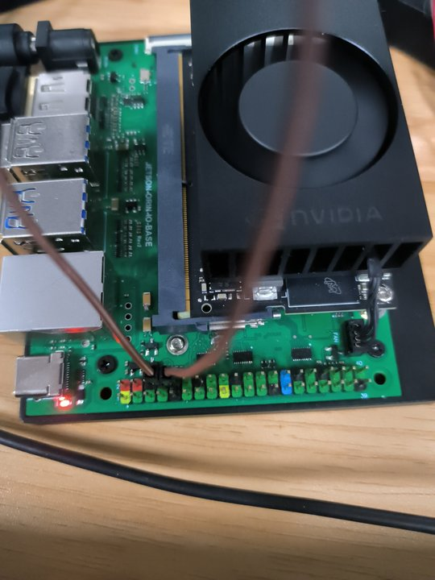
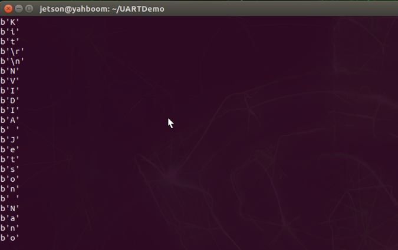
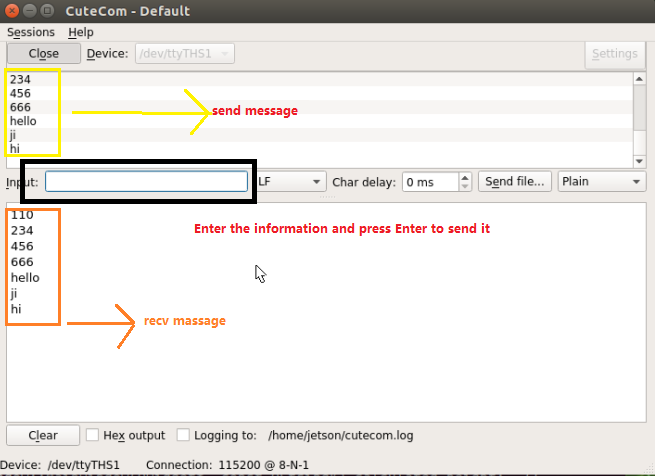

# 4.6 Jetson Orin NX 与外部设备串口通信

## 1. 准备

根据下图，我们可以知道，Jetson Orin NX 的 TXD 和 RXD 引脚分别是物理引脚 8 和 10。


我们直接在板上测试串口通信，即让 RXD 读取 RXD 发送的消息。
所以用杜邦线连接 PIN 8 和 PIN 10，如图：



然后授予串口读写权限：

```bash
sudo chmod 777 /dev/ttyTHS1
```

> [!NOTE]
> 串口的操作权限在关机后会重置，所以每次开机后都需要重新授予权限。

## 2. 运行测试例程

从 GitHub 下载我们的串口通信实例。
这个仓库包含了源代码和解释。

```bash
git clone https://github.com/JetsonHacksNano/UARTDemo.git
```

进入目录
    
```bash
cd UARTDemo
```

如果你不打算在 UART 上使用串行控制台，则需要禁用串行控制台（可能不是个人选择）：
```bash
systemctl stop nvgetty
systemctl disable nvgetty
udevadm trigger
```

为了运行程序，需要安装 python3-serial 库：

```bash
sudo apt-get install python3-serial
```

最后，终端运行程序：
    
```bash
sudo python3 uart_example.py
```

```
nano@nano-desktop:~/UARTDemo$ python3 uart_example.py
UART Demonstration Program
NVIDIA Jetson Nano Developer Kit

```

开始后，终端上就会逐字地展示 Jetson Orin NX 发送的
"NVIDIA Jetson Orin NX Developer Kit" 字符串。



## 3. 用 Linux 的串口助手测试

Linux 有很多串口调试工具，这里演示使用 [Cutecom](https://help.ubuntu.com/community/Cutecom)。

```bash
sudo apt-get install cutecom
sudo cutecom
```

一般来说，Cutecom 不需要什么设置。
只要点击 open 就可以打开串口使用了，然后在 Input 框中输入文本，按 Enter 发送内容给串口。
效果如下图：



## 4. 注意

**如果你正在使用 USB 转 TTL 模块让计算机和 Orin NX 通信，请注意以下几点。**

1. 杜邦线不应太长，否则容易出现乱码。
2. 如果遇到只接收不发送的情况，原因是电压不足。请将 USB 转 TTL 模块的 5V 端口连接到开发板的 5V 端口。
3. 如果线长在合理范围内，但还是遇到乱码，请检查波特率、奇偶校验和停止位是否一致。
4. 更多问题请参考：[串口收不到数据或者收到错误数据 串口乱码总结 - CSDN](https://blog.csdn.net/lxj362343/article/details/89646731)。

