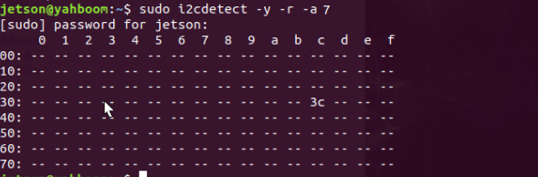
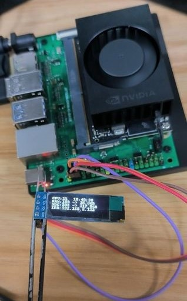

# 4.7 Jetson Orin NX I2C 通信

引脚功能表展示了 I2C 引脚的位置。


## 1. 准备工作

I2C 服务需要先启用，然后才能使用。
首先，在终端安装 I2C 工具：

```bash
sudo apt-get install -y i2c-tools 
```

检查安装状态：

```bash
apt-cache policy i2c-tools
```

如果安装成功，输出应当类似如下（版本可能不同）：

```
i2c-tools:
was installed：4.0-2
candidate： 4.0-2
Version List：
*** 4.0-2 500
500 http://ports.ubuntu.com/ubuntu-ports bionic/universe arm64 Packages
100 /var/lib/dpkg/status
```

在一条总线上扫描 I2C 设备并找出地址。

```bash
# -y: 不需要确认 -r: 以十六进制显示 -a 7: 选择总线 7
sudo i2cdetect -y -r -a 7
```



安装 smbus 库：

```bash
sudo apt-get install -y python3-smbus
```

SMBus 是 System Management Bus 的缩写，是 I2C 的一个子集。
关于 SMBus 库的内容可以参考 PyPI 上的 [smbus2](https://pypi.org/project/smbus2/)
的文档。

## 2. 示例程序

以下是一个使用了亚博的 OLED 屏幕模块的实例程序。

### 硬件连接

| Jetson Orin NX | OLED |
| :---: | :---: |
| pin 3（SDA） | SDA |
| pin 5（SCL） | SCL |
| pin 2（5V） | VCC |
| pin 6（GND） | GND |

示例程序还需要导入 Adafruit_SSD1306 库，可以通过以下命令安装：

```bash
pip install Adafruit_SSD1306
```

### 代码

```python
#!/usr/bin/env python3
# -*- coding: utf-8 -*-
import time
import os

import Adafruit_SSD1306 as SSD

from PIL import Image
from PIL import ImageDraw
from PIL import ImageFont

import subprocess

# V1.0.1
class Yahboom_OLED:
    def __init__(self, i2c_bus=1, debug=False):
        self.__debug = debug
        self.__i2c_bus = i2c_bus
        self.__top = -2
        self.__x = 0

        self.__total_last = 0
        self.__idle_last = 0
        self.str_CPU = "CPU: 0%"

    def __del__(self):
        if self.__debug:
            print("---OLED-DEL---")

    # 初始化 OLED，成功返回 True，失败返回 False
    # Initialize OLED, return True if successful, False if failed
    def begin(self):
        try:
            self.__oled = SSD.SSD1306_128_32(
                rst=None, i2c_bus=self.__i2c_bus, gpio=1)
            self.__oled.begin()
            self.__oled.clear()
            self.__oled.display()
            self.__width = self.__oled.width
            self.__height = self.__oled.height
            self.__image = Image.new('1', (self.__width, self.__height))
            self.__draw = ImageDraw.Draw(self.__image)
            self.__font = ImageFont.load_default()
            if self.__debug:
                print("---OLED begin ok!---")
            return True
        except:
            if self.__debug:
                print("---OLED not found!---")
            return False
```

以上是示例程序的一部分，完整代码可以在 `test_i2c_oled.py` 中找到，
里面还包含例如 IP 获取、TF 卡空间获取、系统时间等功能。
在终端输入以下命令运行：

```bash
sudo python3 test_i2c_oled.py
```

### 实验现象



