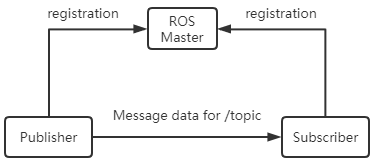

# 6.1 ROS 简介

ROS wiki : http://wiki.ros.org/

ROS教学：http://wiki.ros.org/ROS/Tutorials

ROS安装：http://wiki.ros.org/melodic/Installation/Ubuntu

ROS（Robot Operating System）是一个适用于机器人的开源的操作系统。
它提供了操作系统应有的服务，包括硬件抽象，底层设备控制，常用函数的实现，进程间消息传递，以及包管理。
它也提供用于获取、编译、编写、和跨计算机运行代码所需的工具和库函数。

ROS 的主要目标是为机器人研究和开发提供代码复用的支持。
ROS 是一个分布式的进程（也就是“节点”）框架，这些进程被封装在易于被分享和发布的程序包和功能包中。

ROS 也支持一种类似于代码储存库的联合系统，这个系统也可以实现工程的协作及发布。
这个设计可以使一个工程的开发和实现从文件系统到用户接口完全独立决策（不受 ROS 限制）。
此外，所有的工程都可以被 ROS 的基础工具整合在一起。

## 1.1 ROS 的主要特点

1. **分布式架构**。每一个工作进程都是一个节点，用节点管理器统一管理。
2. **支持多种语言**，包括 C++、Python 等。
3. **良好的伸缩性**。我们可以通过 ROS Launch 将多个节点组合成一个更大的工程。
4. **开源**。ROS 源代码基于 BSD 协议开源，对个体和商业应用及修改都是免费的。

## 1.2 ROS 的整体架构

1. 开源社区级：主要包括开发人员知识、代码、算法共享。
2. 文件系统级：用来描述可以在硬盘上查找到的代码及可执行程序。
3. 计算图级：体现进程与进程、进程与系统之间的通讯。

### 1.2.1 计算图级

#### 节点演示

在终端输入：

```bash
roscore
```

在另一个终端输入：

```bash
rosrun turtlesim turtlesim_node
```

你大概会看到一个弹窗，蓝色的背景和一只🐢。在第 3 个终端输入：

```bash
rosservice call /spawn "x: 3.0
y: 3.0
theta: 90.0
name: 'my_turtle'"
```

现在 "TurtlesSim" 窗口里多了一只🐢。

在第 4 个终端输入：

```bash
rqt_graph
```


以下是常用的 `rosnode` 命令。终端输入 `rosnode help` 也可查看。

| `rosnode` 命令 | 说明 |
| --- | --- |
| `rosnode list` | 列出当前运行的节点 |
| `rosnode info /node_name` | 查看节点的详细信息 |
| `rosnode kill /node_name` | 杀死节点 |
| `rosnode ping /node_name` | 测试节点是否在线 |
| `rosnode machine` | 列出在特定机器或列表机器上运行的节点 |
| `rosnode cleanup` | 清理不可运行节点的注册信息 |

#### 消息

节点之间通过消息实现彼此的逻辑联系和数据交换。

`rosmsg` 是用来查询消息的工具。以下是常用的 `rosmsg` 命令。终端输入 `rosmsg help` 也可查看。

| `rosmsg` 命令 | 说明 |
| --- | --- |
| `rosmsg show` | 显示一条消息字段 |
| `rosmsg list` | 列出所有包中定义的所有消息 |
| `rosmsg package` | 列出包中定义的所有消息 |
| `rosmsg packages` | 列出所有含有该消息的功能包 |
| `rosmsg md5` | 显示消息的 MD5 校验和 |

#### 话题

话题（topic）是一种传递消息的方式。节点可以发布消息到话题（publish），也可以订阅话题以接收消息（subscribe）。
每一条消息都需要发布到特定的话题上，并且所有话题都是强类型的。

ROS 的话题消息可以基于 TCP / IP 或 UDP 协议传输，默认使用的时 TCP / IP。
基于 TCP 的传输称为 TCPTOS，是一种长连接方式；基于 UDP 的传输称为 UDPROS，是一种低延迟、高效率的传输方式，但容易丢失数据，适合远程操作。

`rostopic` 是用来查询话题的工具。以下是常用的 `rostopic` 命令。终端输入 `rostopic help` 也可查看。

| `rostopic` 命令 | 说明 |
| --- | --- |
| `rostopic bw /topic_name` | 显示话题的带宽 |
| `rostopic echo /topic_name` | 输出话题的消息 |
| `rostopic find /message_type` | 查找包含特定消息类型的话题 |
| `rostopic hz /topic_name` | 显示话题的发布频率 |
| `rostopic info /topic_name` | 查看话题有关信息 |
| `rostopic list` | 列出所有活动话题 |
| `rostopic pub /topic_name /message_type` | 发布消息到话题 |
| `rostopic type /topic_name` | 显示话题的消息类型 |

#### 服务

服务用于 "请求 - 应答" 模式的通讯。服务也必须有唯一的名称。
当一个节点提供某服务时，所有的节点都可以请求该服务。

`rosservice` 是用来查询服务的工具。以下是常用的 `rosservice` 命令。终端输入 `rosservice help` 也可查看。

| `rosservice` 命令 | 说明 |
| --- | --- |
| `rosservice args /service_name` | 显示服务的参数 |
| `rosservice call /service_name` | 用输入的参数调用服务 |
| `rosservice find /service_type` | 查找包含特定服务类型的服务 |
| `rosservice info /service_name` | 查看服务的有关信息 |
| `rosservice list` | 列出所有活动服务 |
| `rosservice uri /service_name` | 显示 ROSRPC 服务的 URI |
| `rosservice type /service_name` | 显示服务的类型 |

#### 消息记录包

消息记录包是一种用于保存和回放 ROS 消息数据的工具。这些数据保存在 `.bag` 文件中。

`rosbag` 是用来记录和回放消息的工具。以下是常用的 `rosbag` 命令。终端输入 `rosbag help` 也可查看。

| `rosbag` 命令 | 说明 |
| --- | --- |
| `rosbag check` | 检查一个包文件的完整性——是否可以在当前系统中运行，或者是否可以迁移 |
| `rosbag decompress` | 解压一个包文件 |
| `rosbag filter` | 从一个包文件中提取消息 |
| `rosbag fix` | 修复一个包文件，以便在当前系统中播放 |
| `rosbag info` | 总结一个或多个包文件的内容 |
| `rosbag play` | 播放一个或多个包文件 |
| `rosbag record` | 记录指定话题的内容到一个包文件 |
| `rosbag reindex` | 重新索引包文件 |

#### 参数服务器

参数服务器是可通过网络访问的共享的多变量字典，通过关键字存储在节点管理器上。

`rosparam` 是用来查询参数服务器的工具。以下是常用的 `rosparam` 命令。终端输入 `rosparam help` 也可查看。

| `rosparam` 命令 | 说明 |
| --- | --- |
| `rosparam delete /param_name` | 删除参数 |
| `rosparam dump /file_name` | 将参数保存到文件 |
| `rosparam get /param_name` | 获取参数的值 |
| `rosparam list` | 列出所有参数 |
| `rosparam load /file_name` | 从文件中加载参数 |
| `rosparam set /param_name` | 设置参数的值 |

#### 节点管理器

节点管理器（Master）用于主题、服务名称的注册和查找等。
一个 ROS 系统中如果没有节点管理器，就不会有节点之间的通讯。

### 1.2.2 文件系统级


功能包之间可以配置依赖关系。
如果功能包 A 依赖功能包 B，那么在 ROS 构建系统时，B 一定要早于 A 的构建，并且 A 可以使用 B 中的库文件。

文件系统级的概念如下：

#### 功能包清单

功能包清单（package manifest）是功能包的描述文件，包含了功能包的名称、版本、作者、依赖关系等信息。
功能包中的 `package.xml` 就是一个功能包清单。

#### 功能包

功能包是 ROS 中软件的基本组织形式，包含运行的节点以及配置文件等。

ROS package 相关命令（终端输入 `rospackage help` 查看）：

| `rospack` 命令 | 说明 |
| --- | --- |
| `rospack list` | 列出本机所有功能包 |
| `rospack find /package_name` | 查找功能包的路径 |
| `rospack depends /package_name` | 列出功能包的依赖关系 |
| `rospack profile` | 刷新所有功能包的路径 |

#### 功能包集 / 综合功能包

将几个功能包组合在一起，即可形成一个综合功能包。

#### 消息类型

ROS 中节点之间发送消息时需要事先进行消息说明。
ROS 中提供了若干标准类型消息，也可以自行定义。
消息类型的说明存储在功能包下的 `msg` 目录中。

#### 服务类型

服务类型定义了 ROS 系统中由每个进程提供的关于服务请求和响应的数据结构。

### 1.2.3 开源社区级

#### 发行版（Distribution）

ROS 发行版是可以独立安装、带有版本号的一系列综合功能包。
ROS 发行版像 Linux 发行版一样发挥类似的作用。这使得 ROS 软件安装更加容易，而且能够通过一个软件集合维持一致的版本。

#### 仓库（Repository）

ROS 依赖于共享开源代码与软件库的网站或主机服务，在这里不同的机构能够发布和分享各自的机器人软件与程序。

#### ROS 维基（ROS Wiki）

ROS Wiki 是用于记录有关 ROS 系统信息的主要论坛。
任何人都可以在 ROS 维基注册账户、贡献文件、提供更正或更新、编写教程以及其他行为。

#### Bug 提交系统（Bug Ticket System）

ROS 提供了 Bug 提交系统，用于上传用户发现的问题和提出新功能建议。

#### 邮件列表（Mailing List）

ROS 用户邮件列表是关于 ROS 的主要交流渠道，像论坛一样交流从 ROS 软件更新到 ROS 软件使用中的各种疑问或信息。

#### ROS 问答（ROS Answers）

ROS Answers 是一个问答网站，用户可以在这里提问并回答问题。

## 1.3 通讯机制

### 1.3.1 话题 Topic

ROS 中广为使用的是异步的 publish-subscribe 通讯模式。
Topic 一般用于单向、消息流通讯。

Topic 一般拥有很强的类型定义。一种类型的 topic 只能接受 / 发送特定数据类型（message type）的 message。

发布者（publisher）没有被要求类型一致性，但是接受时订阅者（subscriber）会检查类型的 md5，进而发现。



### 1.3.2 服务 Service

Service 用于处理 ROS 通讯中的同步通讯，采用 server/client 语义。
每个 service type 拥有 request 与 response 两部分。
对于 service 中的服务器（server），ROS 不会检查重名（name conflict），只有最后注册的 server 会生效，与客户端（client）建立连接。


### 1.3.3 任务 Action

Action 是一种更为复杂的通讯机制，使用多个 topic 来实现。
一个 action 包含目标（Goal）、任务执行过程状态反馈（Feedback）和结果（Result）等话题。
一个 action 被编译时将自动产生 7 个结构体：
`Action`, `ActionGoal`, `ActionFeedback`, `ActionResult`, `Goal`, `Feedback`, `Result`。

#### Action 的特点

- 问答式的通讯模式，即客户端发送一个目标，服务器返回一个结果。
- 服务器在任务执行时会连续地反馈。
- 任务过程中可以取消任务。
- 基于 ROS 的消息机制实现。

#### Action 的接口

- `goal`：发布任务目标
- `cancel`：请求取消任务
- `status`：通知客户端当前状态
- `feedback`：周期反馈任务运行的监控数据
- `result`：任务完成后返回的结果，只发布一次

### 通讯模式对比

| | Topic | Service | Action |
| --- | --- | --- | --- |
| 响应机制 | 无 | 结果响应 | 进度响应、结果响应 |
| 同步性 | 异步 | 同步 | 异步 |
| 通讯模型 | publisher / subscriber | server / client | server / client |
| 节点关系 | 多对多 | 多对一 | 多对一 |

## 1.4 常用组件

### Launch 启动文件

启动文件（Launch File）是 ROS 中一种同时启动多个节点的途径，它还可以自动启动 ROS Master 节点管理器，并且可以实现每个节点的各种配置，为多个节点的操作提供很大便利。

### TF 坐标变换

机器人本体和机器人的工作环境中往往存在大量的组件元素，在机器人设计和机器人应用中都会涉及不同组件的位置和姿态。

[TF](http://wiki.ros.org/tf) 是一个让用户随时间跟踪多个坐标系的功能包，它使用树形数据结构，根据时间缓冲并维护多个坐标系之间的坐标变换关系，可以帮助开发者在任意时间、在坐标系间完成点、向量等坐标的变换。

### rqt 工具箱

为了方便可视化调试和显示，ROS 提供了一个 Qt 架构的后台图形工具套件：[rqt_common_plugins](http://wiki.ros.org/rqt_common_plugins)。

其中包含不少实用工具：日志输出工具 `rqt_console`、计算图可视化工具 `rqt_graph`、数据绘图工具 `rqt_plot`、参数动态配置工具 `rqt_reconfigure`。

### RViz 可视化工具

[rviz](http://wiki.ros.org/rviz) 是一款三维可视化工具，很好地兼容了各种基于 ROS 软件框架的机器人平台。在 rviz 中，可以使用 XML 对机器人、周围物体等任何实物进行尺寸、质量、位置、材质、关节等属性的描述，并且在界面中呈现出来。

同时，rviz 还可以通过图形化方式实时显示机器人传感器的信息、机器人的运动状态、周围环境的变化等。

### Gazebo 仿真工具

[Gazebo](https://gazebosim.org) 是一个功能强大的三维物理仿真平台，具备强大的物理引擎、高质量的图形渲染、方便的编程与图形接口。

虽然 Gazebo 中的机器人模型与 rviz 使用的模型相同，但是需要在模型中加入机器人和周围环境的物理属性，例如质量、摩擦系数、弹性系数等。
机器人的传感器信息也可以通过插件的形式加入仿真环境、以可视化的方式显示。

### Navigation

[navigation](http://wiki.ros.org/navigation) 是 ROS 的二维导航功能包。
简单来说，就是根据输入的里程计等传感器的信息流和机器人的全局位置，通过导航算法，计算得出安全可靠的机器人速度控制指令。

### MoveIt

[MoveIt!](https://moveit.ai/) 是最常用的工具包之一，主要用来进行轨迹规划。

[Moveit! 配置助手](https://moveit.github.io/moveit_tutorials/doc/setup_assistant/setup_assistant_tutorial.html)用来配置一些在规划中需要用到的文件，非常关键。

## 1.5 发行版本

参考 [Distributions - ROS Wiki](http://wiki.ros.org/Distributions)。